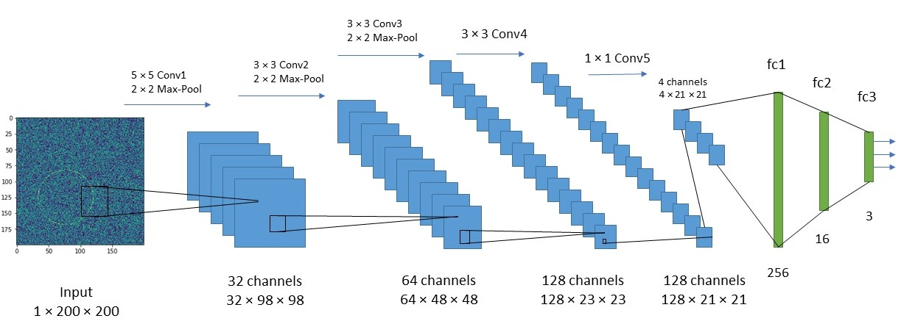
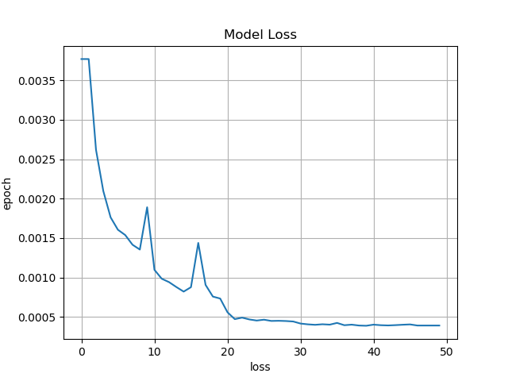
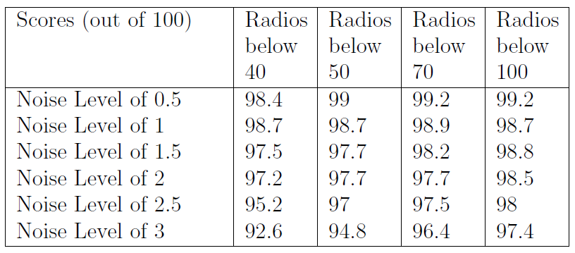

# Cirlcle-Detection-DNN
This is a PyTorch implementation of a Deep Convolutional Neural Network model for detecting the parameters of a circle presents inside a given image under the presence of noise. 

Note: This implementation is using Multi-GPUs for faster training. You can modify train.py to avoid using GPUs.


# Network Architecture



The output of the network is 3 real numbers which represents the detected row, column, and radious of the circle in the noisy image. 

# Getting Started

**Installation**
- Clone this repo:
```shell
git clone https://github.com/hsouri/Cirlcle-Detection-CNN
```

- Requirements
Install the dependencies by running the following command:
```shell
pip install -r requirements.txt
```

# Model training
- Data set making
Before trainig, train set should be created by the following command:

```shell
python dataset.py
```
This will generate 200,000 images with randon level of noise between 0.035 and 3.5. You can create yout own train set with arbitrary number of imaages and arbitrary level of noise by changing number of images and level of noise in the train_set() function.

- Training:

```shell
python train.py
```
You can use your own data set by changing the default dataset by the following command:

```shell
python train.py --data {directory path to your csv train set}
```

- Resume training from a saved model:

You are able to resume training your model from a saved checkpoint by running the following:

```shell
python train.py --resume {directory path to your saved model}
```

You can also change other attributes such as batch size, learning rate, number of epochs, number of workers, resume
and continue training from a checkpoint. List of selectable attributes:

'--name', '--out_file', '--workers', '--batch-size', '--resume', '--data', '--print_freq', '--epochs', '--start_epoch', '--save_freq'

# Model Testing

You can test your model on 1000 random images with level noise of 2 by running the fowwloing command:

```shell
python validation.py
``` 
By default validation is using the my pretrained model. If you're willing to test your own model you must change the checkpoint in the find_circle() function. 


# Traing Loss
Losses for trainig the model will be saved in the `out.txt` file. Trinig loss of 50 epochs is as follows:



# Validation Scores

Validation scores using the metric AP 0.7 are as follows:




